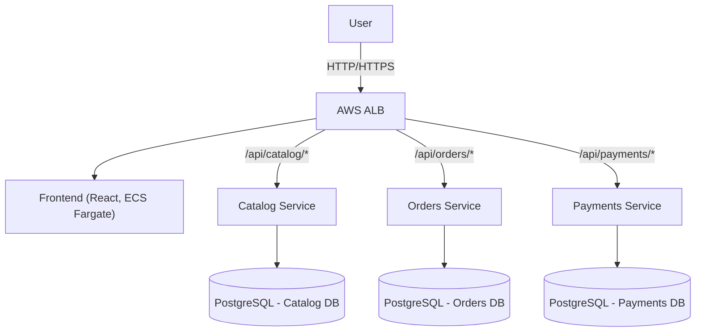
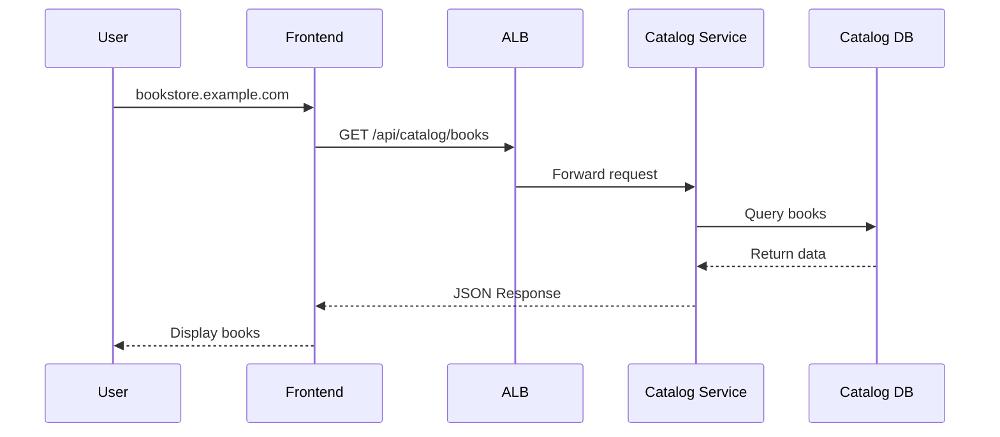
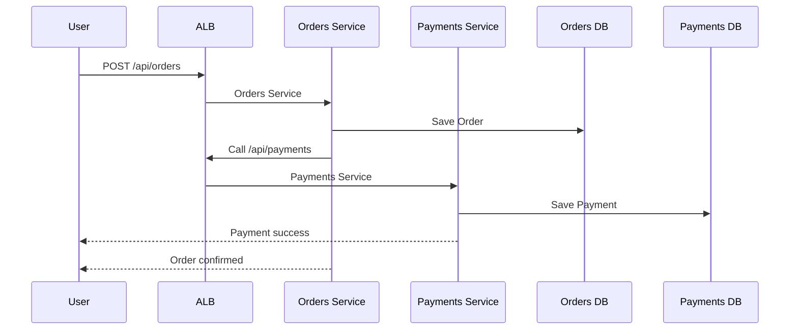
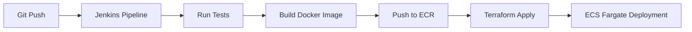

# Bookstore Microservices (DevOps Project)

A cloud-native Bookstore application built with a **microservices architecture**, containerized deployments, and production-ready **AWS infrastructure**.

This project demonstrates end-to-end **DevOps practices**:

- Microservices with **Docker**
- CI/CD pipelines using **Jenkins**
- Infrastructure as Code with **Terraform**
- Secure deployments on **AWS ECS Fargate with RDS**
- Monitoring and observability with **CloudWatch**

---

## Architecture Overview

### Key Components
- **Frontend** → React + Nginx, behind an Application Load Balancer (ALB)  
- **Backend Services** → Node.js microservices:
  - **Catalog Service** (book metadata & inventory)  
  - **Orders Service** (order management)  
  - **Payments Service** (transaction handling)  
- **Databases** → PostgreSQL on Amazon RDS (one per service, private subnets, multi-AZ)  
- **Container Registry** → Amazon ECR  
- **CI/CD** → Jenkins pipelines (build → test → dockerize → push → deploy)  
- **Networking & Security** → Multi-AZ VPC, subnets, NAT Gateway, IAM, Secrets Manager  
- **Observability** → CloudWatch Logs, Metrics, Alarms  

---

## Repository Structure
```

├── Bookstore-frontend/ # React frontend
├── Bookstore-catalog-svc/ # Catalog microservice
├── Bookstore-order-svc/ # Orders microservice
├── Bookstore-payments-svc/ # Payments microservice
├── terraform/ # Infrastructure as Code
│ ├── modules/ # Reusable building blocks
│ │ ├── vpc/
│ │ ├── ecs-cluster/
│ │ ├── ecr/
│ │ ├── alb/
│ │ ├── iam/
│ │ └── rds/
│ └── environments/ # Environment-specific configs
│ ├── dev/
│ └── prod/
├── docs/ # Documentation & diagrams
└── docker-compose.yml # Local development setup

```
---

## System Architecture


## Traffic Flow
Browsing Books

## Placing an Order

## Local Development

Run everything locally with Docker Compose:
```
docker-compose up --build
```
**Services**

- Frontend → http://localhost:3000
- Catalog → http://localhost:3001
- Orders → http://localhost:3002
- Payments → http://localhost:3003

## CI/CD Pipeline (Jenkins)


Each microservice includes a Jenkinsfile:

- **Checkout** → Pull code
- **Install** & Test → npm ci && npm test
- **Build & Push** → Docker image to ECR
- **Deploy** → Terraform updates ECS service

## Infrastructure (Terraform)

Infrastructure is fully automated using Terraform.

Modules

- **VPC** → Multi-AZ, public/private subnets, IGW, NAT Gateway
- **ECS** Cluster → Fargate tasks, services, IAM roles
- **ECR** → Private container registries
- **ALB** → Path-based routing for services
- **IAM** → Roles and policies with least-privilege
- **RDS** → PostgreSQL (multi-AZ, backups, security groups, Secrets Manager)

Environments
- ```terraform/environments/dev``` → Development environment

- ```terraform/environments/prod``` → Production environment

Deploy with:
```
cd terraform/environments/prod
terraform init
terraform apply -auto-approve
```

## Monitoring & Security

- Logs → CloudWatch Logs (per service log group)
- Metrics & Alerts → CPU, memory, error rates
- High Availability → ECS auto-healing, RDS Multi-AZ failover
- Security:
  - IAM roles per service
  - AWS Secrets Manager for DB creds
  - Security Groups with least access

## Documentation

- Bookstore Playbook
- Playbook with RDS Integration
- Traffic Flow Explanation

## About Me

I’m **SaiKrishna Bethamcharla**, a DevOps Engineer with 3+ years of experience.

This project demonstrates:

- Designing and deploying a production-grade microservices system
- Automating everything with Terraform and Jenkins pipelines
- Applying best practices in AWS, CI/CD, and Infrastructure as Code

